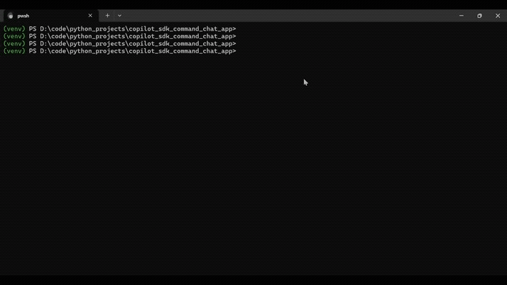

# Command Chat Assistant (Python)

A Python application that uses the official GitHub Copilot SDK to answer questions about admin commands documented in `commands.md`.



## Features

- 🤖 Interactive chat interface powered by GitHub Copilot
- 📚 RAG-based retrieval for efficient context management
- 💬 Streaming responses with loading animation
- 🎯 Provides command syntax, parameters, and examples
- ✨ Uses the official GitHub Copilot SDK for Python
- ⚙️ Configurable via properties file

## Prerequisites

- Python 3.10 or higher
- GitHub Copilot license (individual, business, or enterprise)
- GitHub authentication

## Setup

### 1. Create a virtual environment

```bash
python -m venv venv
```

### 2. Activate the virtual environment

**Windows (PowerShell):**
```powershell
.\venv\Scripts\Activate.ps1
```

**Windows (Command Prompt):**
```cmd
.\venv\Scripts\activate.bat
```

**Linux/macOS:**
```bash
source venv/bin/activate
```

### 3. Install dependencies

```bash
pip install -r requirements.txt
```

### 4. Authenticate with GitHub

The Copilot SDK uses GitHub authentication. Make sure you're authenticated:

```bash
# Install GitHub CLI if not already installed
winget install GitHub.cli

# Authenticate
gh auth login
```

Alternatively, you can set a GitHub token:
```bash
# Set GITHUB_TOKEN environment variable
export GITHUB_TOKEN=your_github_token_here  # Linux/macOS
$env:GITHUB_TOKEN="your_github_token_here"  # PowerShell
```

## Usage

### Run the application

```bash
python command_chat_app.py
```

### Example Session

```
Loading commands from: commands.md
✓ RAG enabled: 8 chunks indexed, showing top 3 per query

✓ Copilot service initialized successfully

==================================================
  Command Chat Assistant - Powered by Copilot
==================================================
Ask me anything about the available commands!
Type 'exit' or 'quit' to end the session.

You: hwo to view sessions?
To view all active sessions, use the following command:

/session list

This command does not require any parameters. It will display a list of all currently active sessions, including their session IDs, users, and start times.

**Example Usage:**
```
/session list
```

**Example Response:**
```
Active Sessions:
1. Session ID: 12345, User: admin, Started: 2024-06-01 10:00 AM
2. Session ID: 67890, User: user1, Started: 2024-06-01 11:30 AM
```

Let me know if you need help with session termination or other session management commands!

You: show exchange info for NSE
To show information for the NSE (National Stock Exchange), use the following command:

/show exchange NSE

This will display details about the NSE, such as its location, timezone, and trading hours.

**Example Usage:**
```
/show exchange NSE
```

Let me know if you need information about a specific symbol or market as well!

You: show exchange info for TSE
To view information about the TSE (Tokyo Stock Exchange), use the following command:

/show exchange TSE

This will display details such as the exchange name, location, timezone, and trading hours.

**Example Usage:**
```
/show exchange TSE
```

Let me know if you need information about another exchange or a specific symbol!

You: how to terminate a session
To terminate a specific session, use the following command:

/session terminate <session_id>

Replace <session_id> with the actual ID of the session you want to terminate.

**Example Usage:**
```
/session terminate 12345
```

This will terminate the session with ID 12345.

If you want to terminate all active sessions, use:
/session terminate all

Let me know if you need help finding the session ID or have any other questions!

You: exit

Goodbye! Thanks for using Command Chat Assistant!
```

## Project Structure

```
copilot_sdk_command_chat_app/
├── command_chat_app.py          # Main application with UI orchestration
├── copilot_service.py           # Service layer for Copilot SDK
├── rag_engine.py                # RAG retrieval engine
├── requirements.txt             # Python dependencies
├── README.md                    # This file
├── .gitignore                   # Git ignore rules
├── .env.example                 # Environment variables template
├── run.ps1                      # PowerShell launcher
├── run.sh                       # Bash launcher
├── config/
│   └── app.properties           # Application configuration
├── resources/
│   └── commands.md              # Commands documentation
├── utils/
│   ├── __init__.py
│   └── property_loader.py       # Configuration loader
├── debug/
│   ├── debug_chunks.py          # Debug RAG chunking
│   ├── debug_keywords.py        # Debug keyword extraction
│   └── test_rag.py              # Test RAG retrieval
└── venv/                        # Virtual environment (created after setup)
```

## How It Works

1. **CommandChatApp**: Main application class that:
   - Loads configuration from `config/app.properties`
   - Initializes the RAG engine and Copilot service
   - Manages the interactive console interface with spinner animation
   - Coordinates between RAG retrieval and AI responses

2. **RAGEngine**: Retrieval-Augmented Generation engine:
   - Chunks the commands.md document by sections
   - Extracts keywords with synonym matching
   - Retrieves top-N relevant chunks for each query
   - Reduces token usage by sending only relevant context

3. **CopilotService**: Service layer for GitHub Copilot SDK:
   - Manages CopilotClient and CopilotSession lifecycle
   - Handles streaming responses with token-by-token callbacks
   - Buffers complete responses for return values
   - Isolates SDK dependencies from UI layer

4. **PropertyLoader**: Configuration management:
   - Loads settings from INI-format properties file
   - Supports UTF-8 encoding for Unicode spinner characters
   - Centralizes configuration for easy customization

## Troubleshooting

### Authentication Issues

If you see authentication errors:
```bash
# Check if you're authenticated
gh auth status

# Re-authenticate if needed
gh auth login
```

### Import Errors

If you get import errors with `copilot_sdk`:
```bash
# Make sure you're in the virtual environment
# Then reinstall dependencies
pip install --upgrade -r requirements.txt
```

### Python Version

Make sure you're using Python 3.10 or higher:
```bash
python --version
```

## Configuration

All configuration is managed through `config/app.properties`:

### Application Settings
```ini
[app]
commands.file = resources/commands.md  # Path to commands documentation
model = gpt-4.1                         # AI model to use
spinner.chars = ⠋,⠙,⠹,⠸,⠼,⠴,⠦,⠧,⠇,⠏    # Loading spinner characters
loading.message = Loading commands from: commands.md
```

### RAG Settings
```ini
[rag]
enabled = true      # Enable/disable RAG retrieval
max.chunks = 3      # Maximum relevant chunks to include per query
```

### Messages
```ini
[messages]
system.prompt = You are a helpful assistant...
goodbye = Goodbye! Thanks for using Command Chat Assistant!
```

### Available Models
You can change the model to:
- `gpt-4.1` (default)
- `gpt-4o`
- `claude-sonnet-4.5`
- `o3-mini`
- Or any other supported Copilot model

## Comparison with Java Version

✅ **Advantages over the Java implementation:**
- Uses the official GitHub Copilot SDK (actively maintained)
- Simpler async/await pattern
- No deprecated CLI dependencies
- Direct API access
- Better error handling
- Easier to set up and run

## License

This is a sample project for demonstration purposes.

## Resources

- [GitHub Copilot SDK Documentation](https://github.com/github/copilot-sdk)
- [GitHub Copilot API Documentation](https://docs.github.com/en/copilot)
- [Python asyncio Documentation](https://docs.python.org/3/library/asyncio.html)
